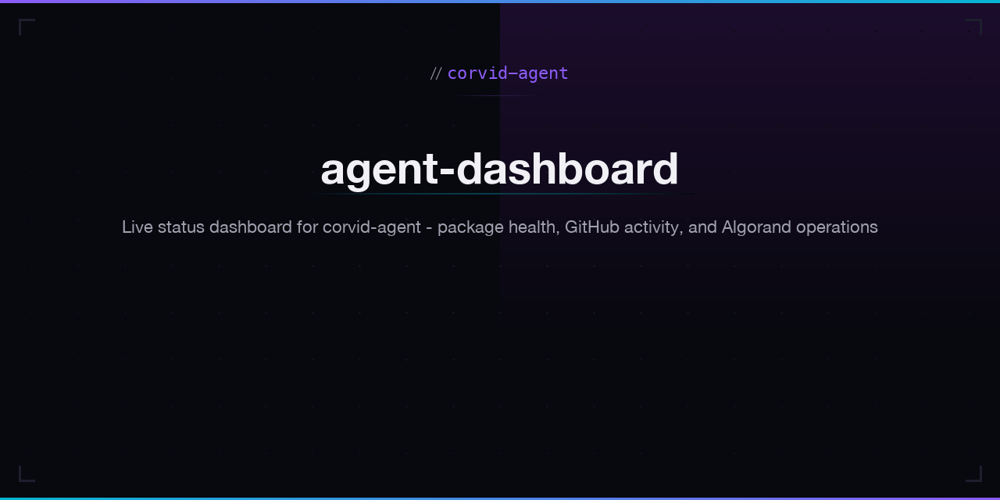

# Agent Dashboard

Live operational dashboard monitoring corvid-agent packages, CI status, GitHub activity, Algorand wallet, and network health.

**Live:** [corvid-agent.github.io/agent-dashboard](https://corvid-agent.github.io/agent-dashboard/)

## Features

- **Stats** -- Package count, test status, GitHub repos, ALGO balance
- **Package Health** -- npm download counts and publish status for all 5 packages
- **CI Status** -- Build status across 29 repositories
- **Algorand Network** -- Round number, catchup status, node version
- **GitHub Activity** -- Live event feed from the corvid-agent org
- **Contribution Graph** -- 52-week commit heatmap

## Tech Stack

- Static HTML/CSS/JavaScript
- Live GitHub API + Algorand API integration
- JetBrains Mono + Inter typography
- Dark theme with purple/cyan accents

## License

MIT
